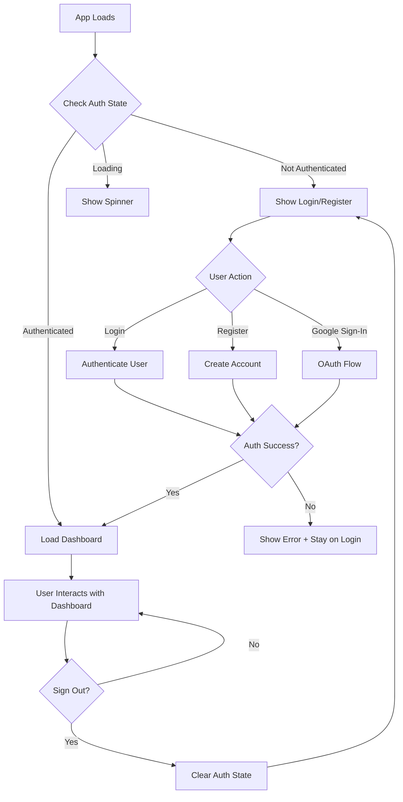

# 🔐 Authentication System Implementation Plan

## **Project Status**
- **Current State**: Budget dashboard accessible without authentication
- **Target State**: Secure dashboard with user authentication and data isolation
- **Priority**: High - Security requirement for production use

## **Current Analysis**
- ✅ Firebase project configured (`cjv-budgetapp`)
- ✅ Firestore database operational for expenses/income/budgets
- ✅ Environment variables configured
- ✅ Production deployment working at https://cjv-budgetapp.web.app
- ⚠️ **No authentication currently implemented**
- ⚠️ **All users share the same data** (security risk)

## **Implementation Strategy**

### **Phase 1: Firebase Authentication Setup**
**Estimated Time**: 1-2 hours

1. **Enable Firebase Auth in Firebase Console**
   ```bash
   # Navigate to Firebase Console → Authentication → Get Started
   # Enable Email/Password and Google sign-in providers
   ```

2. **Add Firebase Auth SDK** 
   ```typescript
   // Update src/services/firebase.ts
   import { getAuth } from 'firebase/auth';
   export const auth = getAuth(app);
   ```

3. **Configure Auth Providers**
   - Email/Password authentication
   - Google OAuth sign-in
   - Configure authorized domains for production

4. **Update Dependencies** (if needed)
   ```bash
   npm install firebase@^11.5.0  # Already installed
   ```

### **Phase 2: Authentication Components**
**Estimated Time**: 4-6 hours

#### **File Structure to Create:**
```
src/
├── components/
│   ├── Auth/
│   │   ├── LoginForm.tsx           # Email/password + Google sign-in
│   │   ├── RegisterForm.tsx        # Email/password registration
│   │   ├── AuthWrapper.tsx         # Login/Register toggle
│   │   └── index.ts                # Export components
│   ├── ProtectedRoute.tsx          # Route protection wrapper
│   └── UserProfile.tsx             # User info + logout button
├── contexts/
│   └── AuthContext.tsx             # Global auth state management
├── services/
│   ├── authService.ts              # Authentication operations
│   └── budgetService.ts            # Update with user filtering
├── hooks/
│   └── useAuth.ts                  # Auth state hook
└── types/
    └── auth.ts                     # Auth-related TypeScript types
```

#### **Component Specifications:**

**LoginForm.tsx**
- Email/password input fields
- Google sign-in button
- Form validation
- Error handling
- "Forgot password" link

**RegisterForm.tsx**
- Email/password/confirm password fields
- Google sign-in option
- Terms acceptance checkbox
- Form validation

**AuthContext.tsx**
- User state management
- Auth persistence
- Loading states
- Sign out functionality

**ProtectedRoute.tsx**
- Route guard component
- Redirect to login if not authenticated
- Loading state while checking auth

### **Phase 3: Data Security & User Isolation**
**Estimated Time**: 3-4 hours

#### **1. Update Firestore Data Structure**
```typescript
// Current structure
expenses/
  {documentId}/
    category: string
    amount: number
    date: string
    // ...

// New structure with user isolation
expenses/
  {documentId}/
    userId: string      // NEW: User identifier
    category: string
    amount: number
    date: string
    // ...
```

#### **2. Update Budget Service**
```typescript
// Add user filtering to all operations
async getExpenses(userId: string): Promise<Expense[]> {
  const q = query(
    collection(db, 'expenses'), 
    where('userId', '==', userId)
  );
  // ...
}

async addExpense(expense: Omit<Expense, 'id'>, userId: string): Promise<string> {
  const expenseWithUser = { ...expense, userId };
  // ...
}
```

#### **3. Firestore Security Rules**
```javascript
// Update firestore.rules
rules_version = '2';
service cloud.firestore {
  match /databases/{database}/documents {
    // Users can only access their own data
    match /expenses/{document} {
      allow read, write: if request.auth != null && 
                         request.auth.uid == resource.data.userId;
      allow create: if request.auth != null && 
                    request.auth.uid == request.resource.data.userId;
    }
    
    match /income/{document} {
      allow read, write: if request.auth != null && 
                         request.auth.uid == resource.data.userId;
      allow create: if request.auth != null && 
                    request.auth.uid == request.resource.data.userId;
    }
    
    match /budgets/{document} {
      allow read, write: if request.auth != null && 
                         request.auth.uid == resource.data.userId;
      allow create: if request.auth != null && 
                    request.auth.uid == request.resource.data.userId;
    }
  }
}
```

### **Phase 4: UI Integration & User Experience**
**Estimated Time**: 2-3 hours

#### **1. App.tsx Updates**
```typescript
function App() {
  return (
    <AuthProvider>
      <Router>
        <Routes>
          <Route path="/login" element={<AuthWrapper />} />
          <Route 
            path="/" 
            element={
              <ProtectedRoute>
                <BudgetDashboard />
              </ProtectedRoute>
            } 
          />
        </Routes>
      </Router>
    </AuthProvider>
  );
}
```

#### **2. Dashboard Header Updates**
- Add user profile section
- Display current user name/email
- Logout button
- User avatar (from Google profile if available)

#### **3. Loading States**
- Auth initialization spinner
- Login form submission states
- Data loading with auth context

## **Technical Implementation Details**

### **Authentication Service Structure**
```typescript
// src/services/authService.ts
export const authService = {
  // Email/Password Auth
  signUpWithEmail: (email: string, password: string) => Promise<UserCredential>
  signInWithEmail: (email: string, password: string) => Promise<UserCredential>
  
  // Google Auth
  signInWithGoogle: () => Promise<UserCredential>
  
  // General Auth
  signOut: () => Promise<void>
  resetPassword: (email: string) => Promise<void>
  getCurrentUser: () => User | null
  
  // Auth State Listener
  onAuthStateChanged: (callback: (user: User | null) => void) => Unsubscribe
}
```

### **Authentication Flow**


### **Security Considerations**

#### **Client-Side Security**
- Input validation for user experience
- XSS prevention through React's built-in protections
- Secure token storage (Firebase handles automatically)

#### **Server-Side Security**
- Firestore security rules enforce data isolation
- Firebase Auth handles JWT token validation
- User session management via Firebase SDK

#### **Data Privacy**
- Each user sees only their own financial data
- No cross-user data leakage possible
- Secure password handling through Firebase Auth

## **Google Sign-In Benefits**
- 🚀 **Faster onboarding** - No password creation required
- 🔒 **Enhanced security** - Google's OAuth2 implementation
- 📱 **Mobile-friendly** - Works seamlessly across devices
- 👤 **Rich user info** - Name, email, profile photo available
- 🔄 **Cross-device sync** - Same account across multiple devices

## **Migration Strategy for Existing Data**

### **Option 1: Clean Start (Recommended)**
- Deploy auth system to new environment
- Users create accounts and start fresh
- Simple and secure approach

### **Option 2: Data Migration**
- Create admin function to assign existing data to first user
- More complex but preserves current data
- Requires careful testing

## **Testing Strategy**

### **Unit Tests**
- Authentication service functions
- Form validation logic
- Auth context state management

### **Integration Tests**
- Login/logout flow
- Protected route access
- Data filtering by user

### **Manual Testing Checklist**
- [ ] User registration works
- [ ] Email/password login works  
- [ ] Google sign-in works
- [ ] Dashboard loads after auth
- [ ] User sees only their data
- [ ] Logout clears state
- [ ] Unauthenticated users redirected
- [ ] Auth state persists on refresh

## **Deployment Steps**

### **1. Development**
```bash
# Install dependencies (if needed)
npm install

# Implement auth components
# Update Firebase security rules
# Test locally

npm run build
npm run test
```

### **2. Firebase Configuration**
```bash
# Deploy Firestore rules
firebase deploy --only firestore:rules

# Deploy hosting with auth
firebase deploy --only hosting
```

### **3. Production Verification**
- Test authentication flows on live site
- Verify data isolation works
- Check Google sign-in configuration
- Monitor for any auth errors

## **Estimated Timeline**
- **Phase 1** (Setup): 1-2 hours
- **Phase 2** (Components): 4-6 hours  
- **Phase 3** (Security): 3-4 hours
- **Phase 4** (Integration): 2-3 hours
- **Testing & Deployment**: 2-3 hours

**Total: 12-18 hours** over 2-3 development sessions

## **Success Criteria**
- ✅ Users must authenticate to access dashboard
- ✅ Each user sees only their own financial data
- ✅ Google sign-in works seamlessly
- ✅ Auth state persists across browser sessions
- ✅ Secure Firestore rules prevent unauthorized access
- ✅ Smooth user experience with proper loading states
- ✅ Production deployment maintains all current functionality

## **Next Steps**
1. **Review this plan** with stakeholders
2. **Enable Firebase Auth** in console
3. **Start with Phase 1** implementation
4. **Test each phase** before proceeding
5. **Deploy incrementally** to minimize risk

---

**Created**: June 16, 2025  
**Status**: Planning Complete - Ready for Implementation  
**Priority**: High - Security requirement for production use